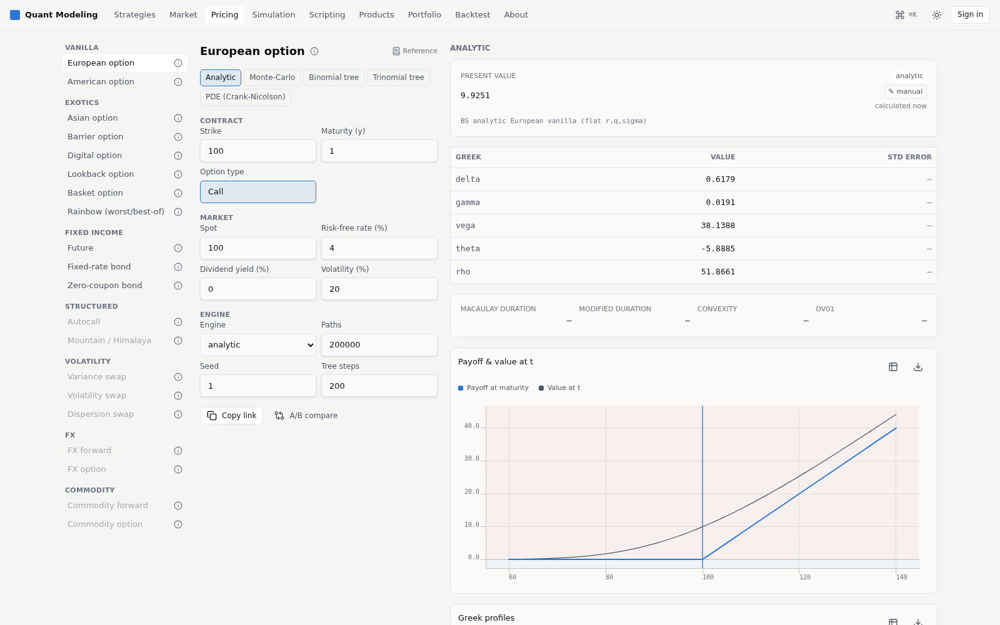
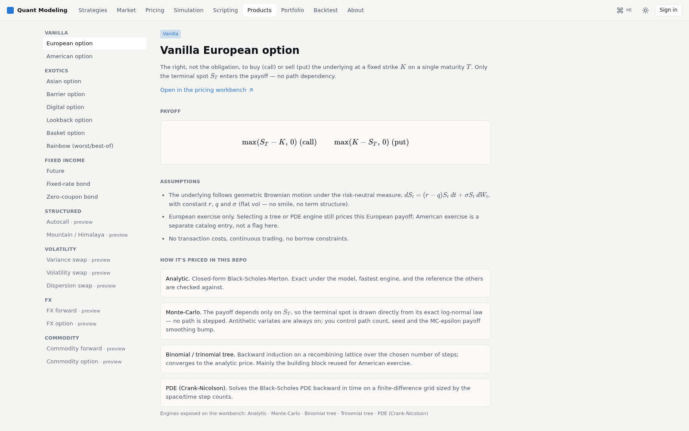
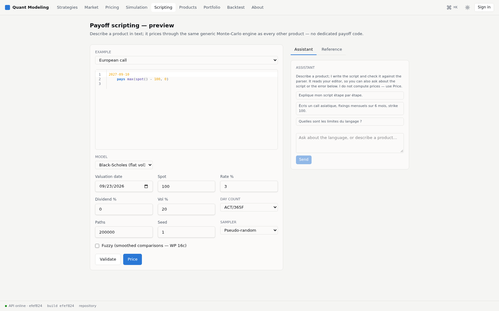

# Quant Modeling

A derivatives-pricing library written the way a desk would build one — C++20
core, exposed all the way to a usable product — built solo, end to end:
pricing engine, API, and front end.

[](https://github.com/HadrienT/quant-modeling/actions/workflows/ci.yml)
[](LICENSE)


**[tramonihadrien.com](https://tramonihadrien.com)** — live demo, self-hosted
(no cloud).

---

## What this is

`include/quantModeling` + `src` is a C++20 pricing library, split the way a
desk library is split: **instruments** (payoffs) know nothing about market
data; **models** know nothing about how they're solved; **engines**
(analytic, tree, PDE, Monte Carlo) know nothing about which product they're
pricing; a **pricer registry** wires the three together per product. No
engine branches on a product type; no instrument reads market data.

That library is then carried all the way to something a non-engineer can use:

```
C++20 core  →  pybind11 bindings  →  FastAPI service  →  React front end
```

Every layer is real, tested, and in the same repo: ~43k lines of C++ behind
~70 GoogleTest suites (plus an AddressSanitizer/UBSan build), a typed Python
API with its own pytest suite, and a React app whose types are generated from
the API's OpenAPI schema — with CI that fails the build on drift.

## Screenshots

**Pricing workbench** — pick a product, an engine, a model; get the price,
the full Greek profile, and a payoff chart, side by side.



**Product catalog** — every instrument documented with its payoff formula,
model assumptions, and which numerical methods price it (and why they should
agree).



**Scripting assistant** — describe a payoff in plain language; a local LLM
drafts it in the project's own payoff DSL and checks the draft against the
real parser before showing it to you. No made-up syntax reaches the screen.



## Highlights

- **~20 instruments** across vanilla, exotics (Asian, barrier, digital,
  lookback, basket, rainbow), structured (autocall, mountain/Himalaya),
  volatility (variance/volatility/dispersion swaps), rates, FX and commodity —
  deliberately not growing further; the roadmap is depth, not a 21st payoff.
- **A dozen-plus models**: Black-Scholes, Heston, Bates, SABR (+ SABR-PDE),
  Dupire local vol (calibrated from an SVI surface via Levenberg-Marquardt),
  rough Bergomi, Merton and Kou jump-diffusion, Hull-White / Vasicek / CIR
  short-rate, Garman-Kohlhagen FX.
- **Four engine families** sharing one interface: closed-form analytic,
  binomial/trinomial trees, Crank-Nicolson PDE, and Monte Carlo (Heston QE,
  Heston COS, a rough Bergomi hybrid scheme) with antithetic variates,
  control variates, Sobol sequences and a Brownian bridge.
- **A payoff scripting language** (lexer → parser → AST → fuzzy-logic
  evaluator, Andreasen–Savine style): one generic Monte-Carlo engine prices
  *any* scripted payoff instead of a dedicated code path per product.
- **Adjoint algorithmic differentiation**: an operator-overloading tape
  (`Number`, checkpointing, a parallel-AAD path) computing full Greek vectors
  in roughly the cost of one extra valuation, instead of bumping every input.
- **Property-based tests over exact-number tests**: call-put parity,
  `in + out = vanilla`, monotonicity bounds, measured log-log convergence
  order — not just "this number equals that number."

## Stack

| Layer | Tech |
|---|---|
| Pricing core | C++20, CMake, vcpkg, Eigen, GoogleTest, Google Benchmark, ASan/UBSan |
| Bindings | pybind11 → a `quantmodeling` wheel |
| API | FastAPI, Pydantic, PostgreSQL, JWT + Google OAuth (PKCE) |
| Front end | React 19, TypeScript, Vite, TanStack Query/Router/Table, Zustand, Tailwind, react-three-fiber (WebGL vol surfaces), CodeMirror, Storybook, Vitest, Playwright |
| Ops | Docker Compose, GitHub Actions, self-hosted behind a Cloudflare Tunnel (no cloud provider) |

## Quality bar

- **C++**: every new engine or instrument ships with a test — ideally a
  property test, not a single numeric equality — and passes an
  AddressSanitizer + UBSan build, not just the release one.
- **Contract-checked API**: the OpenAPI schema and the generated TypeScript
  client are committed; CI regenerates both and fails on any diff.
- **Front-end discipline enforced by lint, not convention**: features can't
  import each other, `shared/` can't import a feature, and no feature file
  exceeds 230 lines — checked by a dedicated test, not a code-review habit.
- **An internal engineering log**: [`CLAUDE.md`](CLAUDE.md) documents the
  actual conventions this repo runs on (build commands, coding conventions,
  deployment model) — written for an AI pair-programming agent, but it's the
  same document a human contributor would need.

## Running it

The C++ core is fully self-contained and builds standalone:

```bash
git clone https://github.com/HadrienT/quant-modeling.git
cd quant-modeling
cmake --preset default && cmake --build build
ctest --test-dir build --output-on-failure
```

The API and front end are real too, but market data (spot, option chains,
FRED curves) comes from a separate `data-ingest` Postgres this public repo
doesn't publish — `docker compose up --build` needs `PGPASSWORD` pointed at
one to fully come up. The live demo above is the fastest way to see the whole
stack running end to end; the full command reference (wheel build, sanitizer
preset, Python tests, OpenAPI regeneration) is in [`CLAUDE.md`](CLAUDE.md).

## License

[MIT](LICENSE)
