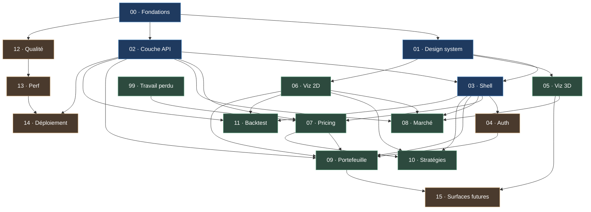

# Blueprint — réécriture du front `web/`

Spécification du chantier en cours. Un fichier par **lot de travail** (WP) dans
[`wp/`](wp/), le graphe de dépendances ci-dessous, la matrice détaillée dans
[`dependencies.md`](dependencies.md), et les arbitrages techniques avec leurs
alternatives rejetées dans [`decisions.md`](decisions.md).

> **Portée.** Ce blueprint couvre le front et ce que l'API doit changer pour le
> servir. Il ne couvre pas la roadmap quant (Heston, AAD, CUDA, xVA) qui vit
> dans [`../etc/roadmap.md`](../etc/roadmap.md) — sauf pour deux points : le
> lot [15](wp/15-future-quant-surfaces.md) définit les emplacements que le
> nouveau front doit réserver pour ces sujets, afin de ne pas avoir à le
> re-découper dans six mois ; et le lot [16](wp/16-scripting.md) est un gros
> morceau de conception du **cœur C++** — il est ici parce que la convention du
> projet veut que ceux-là vivent dans `blueprint/wp/`.

---

## 1. Pourquoi on réécrit

Le front actuel fait ~9 600 lignes et il marche. Ce n'est pas le sujet : il est
**structurellement** en dessous du reste du projet, et c'est la seule couche
qu'un lecteur extérieur voit en premier.

| Constat | Où | Conséquence |
|---|---|---|
| Aucune couche de données : `fetch` à la main, la construction des en-têtes est réécrite à l'identique dans 6 fonctions alors que le helper `headers()` existe juste au-dessus | [`web/src/api/client.ts`](../web/src/api/client.ts) | Pas de cache, pas de retry, pas d'annulation, pas d'états de chargement cohérents |
| Types du client écrits à la main, jamais confrontés aux modèles Pydantic | idem | Dérive silencieuse dès qu'un champ change côté API |
| `styles.css` monolithique de 1 413 lignes, portée globale, aucun token de composant | [`web/src/styles.css`](../web/src/styles.css) | Toute modification est un risque de régression à distance |
| Bundle unique de **5,3 Mo** (1,6 Mo gzip), aucun code-splitting | build Vite | Premier rendu lent, Plotly chargé même sur les pages sans graphique |
| État de page géant : `usePricing.ts` 654 lignes, `Backtest.tsx` 762 lignes | `web/src/pages/` | Intestable, impossible à faire évoluer sans tout relire |
| **Zéro test** dans `web/` | — | Le seul filet est le typecheck |
| Erreurs eslint déjà présentes (`react-hooks/set-state-in-effect`, setters inutilisés) | `Market.tsx`, `usePricing.ts` | Le lint n'est pas bloquant, donc il ne protège rien |
| Accessibilité absente : la modale d'auth est un `
` avec `createPortal`, sans piège de focus, sans `aria-modal`, sans restitution du focus | [`web/src/App.tsx`](../web/src/App.tsx) | Inutilisable au clavier |
| La marque de nav fait `window.location.reload()` au lieu de naviguer | idem | Rechargement complet en guise de navigation |
| **`VITE_API_KEY` est inliné dans le bundle** | `docker-compose.yml` → `client.ts` | La clé d'API part dans le JavaScript du navigateur (voir §3) |

Rien de tout ça ne se répare fichier par fichier : c'est le socle qui manque.
D'où le choix **greenfield dans `web/`** (voir [`decisions.md`](decisions.md#adr-004--greenfield-dans-web-pas-de-dossier-parallèle)).

## 2. Ce qu'on vise

Un poste de travail de pricing, pas un site vitrine. Trois qualités
non négociables, dans cet ordre :

1. **Densité et lisibilité numérique.** Chiffres en chasse fixe tabulaire,
   incertitude Monte-Carlo affichée à côté de la valeur qu'elle qualifie,
   jamais un prix sans son erreur standard. Un desk lit des tableaux, pas des
   cartes décoratives.
2. **Vérité sur l'état.** Chaque donnée affichée dit d'où elle vient (marché
   réel / saisie manuelle), quand elle a été calculée, et si elle est périmée.
   Un chiffre gris et daté vaut mieux qu'un chiffre faux et confiant.
3. **Une pièce spectaculaire assumée : la surface 3D.** Rendu WebGL temps réel
   (three.js / R3F), éclairage, colormap en shader, coupes interactives. C'est
   la démonstration visuelle du projet — voir [WP 05](wp/05-viz-3d.md).

## 3. Le point de sécurité à traiter avant tout le reste

`docker-compose.yml` passe `VITE_API_KEY=${API_KEY}` au service web. Vite
**inline les variables `VITE_*` à la compilation** : la clé se retrouve en
clair dans le JavaScript servi au navigateur. En production
(`web/Dockerfile.prod`) la variable n'est pas transmise, donc l'en-tête
`X-API-KEY` n'est jamais envoyé et nginx ne l'injecte pas non plus — les routes
portant `Depends(require_api_key)` (market, backtest) répondraient 401 dès que
`API_KEY` est défini côté API.

Autrement dit la clé **fuit en dev et ne protège rien en prod**. Le mécanisme
est à remplacer, pas à déplacer : c'est le préalable du
[WP 02](wp/02-api-layer.md) et du [WP 14](wp/14-deploy-selfhost.md).

## 4. Les lots de travail

| WP | Titre | Résumé |
|---|---|---|
| [00](wp/00-foundations.md) | Fondations & outillage | Vite/React 19/TS strict, Tailwind v4 + shadcn/ui, arborescence `app/ features/ shared/`, eslint bloquant, CI front |
| [01](wp/01-design-system.md) | Design system | Tokens, thème sombre par défaut, typographie financière, primitives de densité (`Metric`, `NumberCell`, `Uncertainty`) |
| [02](wp/02-api-layer.md) | Couche API & données | Types générés depuis l'OpenAPI FastAPI, test de dérive, client typé, TanStack Query, normalisation des erreurs |
| [03](wp/03-app-shell.md) | Shell applicatif | Routage typé, layout, palette de commandes ⌘K, thème, toasts, error boundaries, squelettes |
| [04](wp/04-auth-session.md) | Auth & session | Dialog accessible, expiration, routes protégées, portefeuilles locaux anonymes, sortie de `localStorage` |
| [05](wp/05-viz-3d.md) | Visualisation 3D | Moteur de surface WebGL : colormap en shader, coupes, survol, arêtes, dégradation gracieuse |
| [06](wp/06-viz-2d.md) | Visualisation 2D | Séries temporelles (lightweight-charts) et graphiques analytiques (visx) sur les mêmes tokens |
| [07](wp/07-pricing-workbench.md) | Atelier de pricing | Catalogue en données, formulaires zod, matrice produit × engine, comparaison A/B, URL partageable, fiches produit KaTeX |
| [08](wp/08-market-data.md) | Données de marché | Price tape, surface IV brute / nettoyée / local vol, courbes de taux, panneau de qualité des données |
| [09](wp/09-portfolio-risk.md) | Portefeuille & risque | Table virtualisée, pricing par lot, agrégats de risque, stress, VaR/ES, import-export |
| [10](wp/10-strategy-visualizer.md) | Stratégies | Constructeur multi-legs, payoff et P&L, profils de greeks, édition des strikes au graphique |
| [11](wp/11-backtest.md) | Backtest | Formulaire, courbe d'equity vs S&P, drawdown, allocation, métriques, comparaison de runs |
| [12](wp/12-quality-testing.md) | Qualité & tests | Vitest, RTL, MSW, Playwright, axe, régression visuelle, tests de discipline |
| [13](wp/13-perf-budget.md) | Performance & budgets | Découpage par route, budgets de bundle, Web Vitals, budget d'images 3D |
| [14](wp/14-deploy-selfhost.md) | Déploiement auto-hébergé | Config runtime (fin du `VITE_*` inliné), compose de prod, en-têtes de sécurité, TLS |
| [15](wp/15-future-quant-surfaces.md) | Surfaces quant à venir | Emplacements réservés : calibration, AAD vs bump, bench GPU, profils xVA, validation |
| [16](wp/16-scripting.md) | Scripting de payoffs *(cœur C++)* | Langage de payoff façon Andreasen & Savine : lexer, AST, visiteurs, logique floue, un seul moteur MC pour tout produit |
| [99](wp/99-recovered-work.md) | Travail perdu à refaire | Fiches produit disparues avec la VM |

## 5. Graphe de dépendances

**Lecture rapide :** `00 → {01, 02} → 03` est le **chemin critique**, tout le
reste en dépend. `01` et `02` sont parallélisables (l'un est visuel, l'autre est
réseau). Une fois `03` livré, les cinq pages (`07`–`11`) sont indépendantes
entre elles à une exception près : `09` réutilise les formulaires produit de
`07`, et `10` réutilise son moteur de payoff.

## 6. Séquencement proposé

| Phase | Lots | Livrable vérifiable |
|---|---|---|
| 1 — Socle | 00, 01, 02 | Une page blanche stylée qui appelle `/health` avec des types générés, et une CI front qui casse sur un lint |
| 2 — Coquille | 03, 04, 12 (amorce) | Navigation, thème, ⌘K, connexion accessible au clavier, premiers tests |
| 3 — Vitrine | 05, 06, 08 | Surface IV en WebGL, price tape, courbes de taux — c'est la capture d'écran du README |
| 4 — Métier | 07, 99, 10 | Atelier de pricing complet avec fiches produit, visualiseur de stratégies |
| 5 — Risque | 09, 11 | Portefeuille, stress, VaR, backtest |
| 6 — Industrialisation | 12 (complet), 13, 14 | Tests e2e sur la stack compose, budgets tenus, déploiement auto-hébergé |
| 7 — Extension | 15 | Écrans branchés au fur et à mesure que la roadmap quant avance |

L'ordre 3 avant 4 est délibéré : la surface 3D est la pièce qui donne envie de
continuer, et elle valide le socle sur le cas le plus exigeant (gros volume de
données, rendu continu, interaction) avant d'écrire cinq formulaires.

## 7. Règles qui s'appliquent à tous les lots

- Un lot n'est **pas** terminé tant que ses critères d'acceptation ne sont pas
  vérifiables par une commande. « Ça a l'air bien » n'est pas un critère.
- L'ancien code est **supprimé** au fur et à mesure, jamais laissé en doublon.
  Chaque lot liste les fichiers qu'il tue.
- Chaque lot est une branche et au moins une issue GitHub (voir
  [`../CLAUDE.md`](../CLAUDE.md)). L'issue référence son fichier de lot.
- Prose de ce dossier en français ; code, identifiants et interface en anglais.
