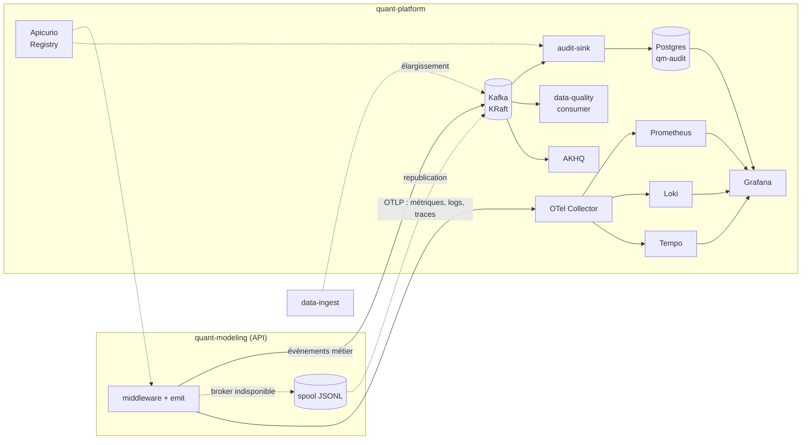
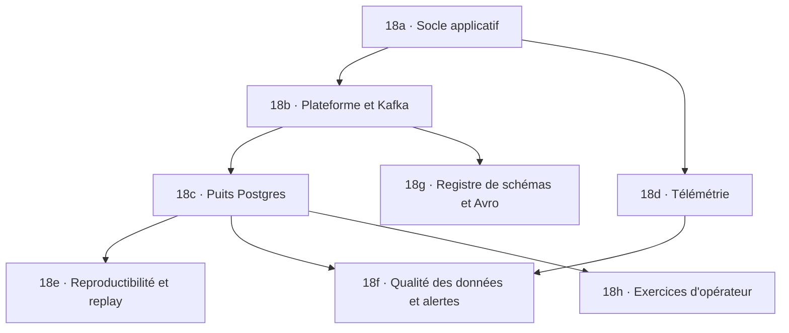

# WP 18 — Observabilité, piste d'audit et gouvernance des valorisations (Kafka)

| | |
|---|---|
| **Dépend de** | le réseau `dataplatform` et le déploiement auto-hébergé ([lot 14](14-deploy-selfhost.md)) ; pour le [lot 18e](#lot-18e--reproductibilité-et-replay), l'API de pricing telle qu'elle est (la graine MC est déjà dans les schémas) |
| **Bloque** | l'auditabilité des valorisations du capstone xVA ([`etc/roadmap.md`](../../etc/roadmap.md) §4d) ; la fin des replis en direct de `vol_surface.py` (on ne peut pas prouver qu'ils ont disparu sans les mesurer) |
| **Branches** | `core/observability` dans ce dépôt ; un dépôt séparé `quant-platform` pour l'infrastructure (voir [§1](#1-où-ça-vit--deux-dépôts-un-contrat)) |
| **Références** | Fed / OCC, *SR 11-7 — Supervisory Guidance on Model Risk Management*, 2011 ; PRA, *SS1/23 — Model risk management principles for banks*, 2023 ; Shapira, Palino, Sivaram, Petty, *Kafka: The Definitive Guide*, 2ᵉ éd., O'Reilly 2021 ; Kleppmann, *Designing Data-Intensive Applications*, O'Reilly 2017 (ch. 11) ; Richardson, *Microservices Patterns*, Manning 2018 (transactional outbox) ; Majors, Fong-Jones, Miranda, *Observability Engineering*, O'Reilly 2022 |

> **État (septembre 2026).** Côté `quant-modeling`, les lots **18a, 18b
> (`KafkaSink`), 18d (instrumentation de l'API) et 18e** sont livrés, et le
> branchement sur la plateforme est le défaut en production
> (`docker-compose.prod.yml`). Côté `quant-platform`, ses lots 00–06 (Kafka,
> base d'audit et puits, télémétrie, qualité des données et alertes, registre,
> laboratoire) sont construits. Reste ouvert côté producteur : l'encodage
> **Avro** des événements (18g, optionnel — ils partent en JSON, que le puits
> accepte, D7). Écarts à ce document consignés dans
> [ADR-011](../decisions.md#adr-011--le-producteur-daudit-branché-sur-quant-platform-wp-18b-18d-18e),
> dont une quatrième issue de replay, `not_reproduced`. Procédure
> d'exploitation : [`deploy/RUNBOOK.md`](../../deploy/RUNBOOK.md) §9.

> **Ce lot a deux buts qui ne pèsent pas pareil.** Le premier est pratique :
> savoir quand l'API quitte la base pour un repli, qui se connecte, quels
> pricings tournent. Le second est pédagogique et il est explicite : **apprendre
> à monter ce qu'un desk monte** — un bus d'événements Kafka, une piste d'audit,
> la reproductibilité des valorisations, une stack de télémétrie. Quand les deux
> tirent dans des directions différentes (Kafka est surdimensionné pour ce
> volume, voir [§2](#2-kafka-ici--ce-quil-apporte-et-ce-quil-ne-justifie-pas)),
> c'est le second qui gagne, et le document le dit chaque fois.

## Objectif

Que le système puisse répondre, **par une requête SQL ou un tableau de bord**, à
des questions comme :

- Combien de fois hier l'API a-t-elle quitté la base pour un repli (yfinance,
  taux par défaut) ? Pour quels tickers ?
- Ce prix, affiché mardi à 17 h, de quoi dépendait-il exactement — quelles
  données, de quelle date, quelle version du code — et **retrouve-t-on le même
  nombre en le recalculant aujourd'hui** ?
- Qui s'est connecté, qui a échoué, depuis quelles adresses (hachées), à quel
  rythme ?
- Quel est le p95 de latence d'un autocall Heston, et qu'est-ce qui l'a
  dégradé depuis le dernier déploiement ?

## Ce qui existe (vérifié dans le code)

| Constat | Où |
|---|---|
| Un logger JSON vers un fichier et stdout, sans rotation applicative | [`logging_utils.py`](../../api/app/logging_utils.py) |
| Un middleware qui écrit une **chaîne de texte libre** : pas d'identifiant de requête, pas d'utilisateur, route non normalisée | `CacheLoggingMiddleware` dans [`main.py`](../../api/app/main.py) |
| ~30 appels `logger.info` écrits à la main dans le routeur de pricing, paramètres non conservés | [`routers/pricing.py`](../../api/app/routers/pricing.py) |
| **Aucun** log d'authentification (succès, échec, 429) | [`auth.py`](../../api/app/auth.py) |
| Les replis sont un `logger.info("... fetching live")` parmi les autres : `fetch_option_chain`, `get_spot`, `get_dividend_yield` ; le taux 0,04 du backtest | [`vol_surface.py`](../../api/app/vol_surface.py), [`routers/backtest.py`](../../api/app/routers/backtest.py) |
| Une `ContextVar` par requête existe déjà pour le *cache hit* | [`request_context.py`](../../api/app/request_context.py) |
| Le motif « interface + implémentation locale » existe déjà | `Storage` (Protocol) dans [`storage.py`](../../api/app/storage.py) |
| Le volume `qm_logs` existe déjà dans le compose de prod | [`docker-compose.prod.yml`](../../docker-compose.prod.yml) |
| La graine MC est un champ des requêtes (`seed: int = 1`) : le pricing MC est déterministe à graine fixée | [`schemas.py`](../../api/app/schemas.py) |
| Le SHA de l'app est connu (`COMMIT_SHA`, `/health`) ; **le wheel C++ n'est pas estampillé** | [`main.py`](../../api/app/main.py) |

---

## 1. Où ça vit — deux dépôts, un contrat

La question posée : le projet est déjà passé de « lib C++ » à « lib + API + web »
dans un seul dépôt, faut-il y ajouter aussi Kafka, Prometheus, Grafana ?

**Non : on coupe en deux, et la coupure suit le motif que vous avez déjà.**
`data-ingest` est un dépôt séparé, avec son propre `docker-compose.yml`, qui
publie un Postgres sur le réseau Docker externe `dataplatform` ; `quant-modeling`
s'y raccorde par nom de conteneur. La nouvelle infra suit la même voie.

**La règle qui départage.** *Deux choses vivent dans le même dépôt si elles
changent ensemble et doivent être livrées de façon atomique ; sinon, elles se
parlent par un contrat versionné.*

- Le front et l'API changent **ensemble** : un champ ajouté à un schéma Pydantic
  casse le type TypeScript généré, et la CI `api-contract` l'attrape (ADR-005).
  Le monorepo est le bon choix pour eux.
- Kafka, Loki ou Grafana **ne changent pas avec une PR de pricing**. Redéployer
  l'API (`scripts/deploy.sh`) ne doit pas redémarrer le broker ; mettre à jour
  Grafana ne doit pas reconstruire l'image C++. Leur cycle de vie est celui d'une
  plateforme, et elle servira aussi à `data-ingest`, `AgenticEnv`, `JobTracker` :
  c'est le sens de « élargir son usage après ».

| Vit dans **`quant-modeling`** (ce dépôt) | Vit dans **`quant-platform`** (nouveau dépôt) |
|---|---|
| `api/app/audit/` : enveloppe d'événement, `emit()`, transports, `record_fallback()` | `docker-compose.yml` : Kafka (KRaft), Apicurio Registry, AKHQ, Postgres d'audit, OTel Collector, Prometheus, Loki, Tempo, Grafana |
| Les **schémas** des événements que l'API produit (elle en est propriétaire) | `sink/` : le consommateur Kafka → Postgres (`audit-sink`) |
| Le middleware, l'instrumentation OpenTelemetry, les métriques métier | `topics/` : la définition des topics **en code** (partitions, rétention) |
| L'endpoint de **replay** (il a besoin du wheel pour re-pricer) et son test | `grafana/` : sources de données et tableaux de bord provisionnés en fichiers |
| L'estampillage du wheel (SHA de build) | `alerts/` : règles d'alerte, `scripts/smoke.sh` |
| Ses tests, avec un faux transport (aucun Kafka requis) | Le SQL du schéma d'audit et de ses rôles |

**Le contrat entre les deux** est petit et explicite : les **noms de topics**,
l'**enveloppe** ([§4](#4-lenveloppe-dévénement-et-les-topics)) et le **registre
de schémas**. Le producteur enregistre son schéma au déploiement ; le
consommateur le lit dans le registre. Le registre est donc littéralement
l'endroit où deux dépôts se rencontrent — c'est le rôle qu'il joue en entreprise.

**Le dépôt existe** : `~/quant-platform` (créé localement, son propre
`CLAUDE.md` et son blueprint `WP 00–06`). Ce document reste la **vue d'ensemble**
et la conception côté producteur (lots 18a et 18e, et le `KafkaSink` de 18b) ;
pour la moitié plateforme, **le contrat (topics, enveloppe, rôles SQL) est
canonique là-bas**, dans `docs/contract.md`.

**Ce que ça coûte, honnêtement.** Deux dépôts, c'est deux CI, deux `git pull`
sur le serveur, et un changement qui touche les deux (nouveau type d'événement)
demande deux PR coordonnées. C'est le prix normal d'une plateforme partagée, et
il est acceptable parce que le contrat évolue rarement (règles de compatibilité
au [lot 18g](#lot-18g--registre-de-schémas-et-avro-optionnel)).

**Ce qui ne change pas** : `~/quant-modeling-prod` reste le seul dossier de
déploiement de l'API. La plateforme aura son propre dossier de déploiement sur
le serveur, sur le même modèle (voir [§9](#9-déploiement)).

---

## 2. Kafka ici — ce qu'il apporte et ce qu'il ne justifie pas

À ce volume (quelques événements par seconde au pire), **Postgres seul suffirait**
et serait plus simple. Il faut le dire pour ne pas se raconter d'histoire :
Kafka est ici un choix d'**apprentissage**. Cela dit, il apporte des propriétés
réelles qui correspondent à ce qu'on veut :

| Propriété | Pourquoi elle sert ici |
|---|---|
| **Découplage temporel** : le producteur écrit dans un journal, il n'attend pas la base | Une panne de la base d'audit ne ralentit ni ne casse un pricing |
| **Journal rejouable** : les consommateurs lisent à leur rythme depuis un *offset* | On peut reconstruire la base d'audit de zéro, ou brancher un nouveau consommateur sur l'historique |
| **Plusieurs consommateurs indépendants** sur le même flux (groupes) | Le même événement `data.fallback` alimente l'archive Postgres *et* le contrôle qualité *et* l'alerte, sans que l'API le sache |
| **Ordre par clé** dans une partition | La suite d'échecs de connexion d'un même utilisateur reste ordonnée |
| Un vrai standard de l'industrie | C'est ce qu'on retrouve sur les desks (bus d'événements de trades, de marché, de risque) |

**Ce que Kafka n'est pas dans ce lot** : le transport de la télémétrie. Les
métriques (Prometheus scrape), les logs (Loki) et les traces (Tempo) prennent
leur chemin habituel via OpenTelemetry. Kafka porte les **événements métier
dont on doit répondre** : valorisations, authentification, replis, assistant.
C'est une frontière nette et à retenir : la télémétrie tolère de perdre un
échantillon, la piste d'audit non.

**Ce qu'on apprend, lot par lot** — c'est le programme de la formation :

| Notion Kafka | Lot |
|---|---|
| Topic, partition, clé, ordre garanti *par partition* seulement | 18b |
| Producteur : `acks=all`, idempotence, `linger.ms`, `produce()` non bloquant et callback de livraison | 18b |
| Groupes de consommateurs, offsets, commit manuel, rééquilibrage | 18c |
| Sémantique de livraison : *at-least-once* + puits idempotent = effet unique | 18c |
| Dead-letter topic | 18c |
| Rétention vs compaction ; Kafka n'est pas l'archive | 18c |
| Retard de consommation (*consumer lag*) comme métrique de santé | 18d |
| Évolution de schéma, modes de compatibilité (backward / forward / full) | 18g |
| Réplication, ISR, `min.insync.replicas`, panne d'un broker | exercice 18h |

---

## 3. Architecture



**Deux chemins parallèles, volontairement.** Les événements métier vont dans
Kafka (durables, rejouables, auditables). La télémétrie va à l'OTel Collector
(éphémère, agrégée). Les deux partagent le `request_id` / `trace_id`, ce qui
permet de passer d'une ligne d'audit à la trace qui l'a produite.

**Une propriété de sécurité qui se gagne gratuitement** : l'API n'a **aucun
identifiant** de la base d'audit. Elle produit dans Kafka, point. Seul
`audit-sink` écrit en base. Un attaquant qui compromet l'API ne peut donc pas
réécrire l'historique — il ne peut qu'ajouter des événements.

---

## 4. L'enveloppe d'événement et les topics

### 4.1 Enveloppe (commune à tous les événements)

```json
{
  "event_id":    "0198f2c4-7b1e-7a3d-9f10-2a6c5e8d4b71",
  "type":        "pricing.valuation",
  "version":     1,
  "occurred_at": "2026-09-19T17:03:11.482Z",
  "request_id":  "req_01J8ZK3V9Q",
  "trace_id":    "4bf92f3577b34da6a3ce929d0e0e4736",
  "username":     "hadrien",
  "producer":    { "service": "quant-modeling-api", "git_sha": "6e251ca", "lib_build": "a13f09c" },
  "payload":     { }
}
```

- `event_id` est un **UUID v7** (ordonné dans le temps) : c'est la clé
  d'idempotence du puits ([lot 18c](#lot-18c--puits-postgres-append-only)).
- `version` est la version du **schéma du payload**, pas de l'enveloppe.
- `username` vaut `null` pour l'anonyme ; jamais de mot de passe, jamais de
  jeton, jamais d'en-tête `Authorization`, **par construction** (le payload est
  un modèle typé, pas un dictionnaire libre).
- Les adresses IP ne sont **jamais en clair** dans un événement : voir
  [§7](#7-données-personnelles-et-confidentialité).

### 4.2 Topics

Convention : `qm.<domaine>.<sujet>.v<N>`. Un topic par sujet, pas un topic par
service : c'est le sujet qui a un schéma et une rétention.

| Topic | Clé | Part. | Rétention Kafka | Contenu |
|---|---|---|---|---|
| `qm.audit.valuation.v1` | `username` (ou `anon:<hash ip>`) | 3 | 90 j | une valorisation complète ([§6](#6-lenregistrement-de-valorisation)) |
| `qm.audit.auth.v1` | `username` (ou `anon:<hash ip>`) | 3 | 90 j | `login_ok`, `login_failed`, `register`, `rate_limited`, `token_invalid` |
| `qm.dataquality.fallback.v1` | `kind` | 1 | 90 j | un repli ou une donnée périmée / proxifiée |
| `qm.http.access.v1` | `route` | 3 | 14 j | une requête HTTP (volumineux, faible valeur d'audit) |
| `qm.assistant.chat.v1` | `username` | 1 | 30 j | latence, script valide ou non ; **pas le contenu** par défaut |
| `qm.dlq.v1` | `source_topic` | 1 | 30 j | messages rejetés par un consommateur, avec l'erreur en en-tête |

**Pourquoi 3 partitions sur certains et 1 sur d'autres.** Le volume ne les
justifie pas : c'est pour apprendre. Avec 3 partitions on voit l'ordre par clé,
la répartition entre consommateurs d'un même groupe, et le rééquilibrage. Avec 1
on voit l'ordre total. Les deux comportements sont à observer, pas à deviner.

**Pourquoi la clé n'est pas le `request_id`.** L'ordre qui compte pour l'audit
est l'ordre *des actions d'un même utilisateur* : les échecs de connexion en
rafale, puis le succès. Clé = `username` garantit cet ordre dans une partition.

**Kafka n'est pas l'archive.** Une rétention de 90 jours suffit pour rejouer et
reconstruire ; la **source de vérité durable est Postgres** ([§5.3](#53-la-base-daudit)).

---

## 5. Composants

### 5.1 Côté API — `api/app/audit/`

Même idiome que `storage.py` : une interface, des implémentations, un choix par
variable d'environnement.

```python
class EventSink(Protocol):
    def publish(self, event: Event) -> None: ...   # ne bloque pas, ne lève pas
    def close(self) -> None: ...
```

| Implémentation | Usage |
|---|---|
| `SpoolSink` | ajoute une ligne JSON à `/app/logs/spool/*.jsonl`. **Seul transport du lot 18a**, filet de sécurité ensuite |
| `KafkaSink` | producteur `confluent-kafka` (librdkafka, licence Apache 2.0) ; en cas d'échec, retombe sur `SpoolSink` |
| `InMemorySink` | tests : on inspecte les événements émis |

**Contrat d'`emit()`** : il **ne lève jamais** et **ne bloque jamais** la
requête. L'audit ne doit pas devenir la première cause de panne du pricing.
L'abandon d'un événement (file pleine, sérialisation impossible) incrémente un
compteur `qm_audit_dropped_total` et l'écrit sur stderr : un événement perdu
doit se voir.

**Producteur Kafka.** `acks=all`, `enable.idempotence=true` (pas de doublon sur
retry), `linger.ms=20` (micro-lots), compression `zstd`. `produce()` est
asynchrone : un thread appelle `poll()` pour déclencher les *callbacks* de
livraison ; un callback en erreur renvoie l'événement vers le spool. Un
republicateur relit le spool par lots et l'efface au fil des acquittements.
`flush()` au signal d'arrêt.

**`record_fallback(kind, **ctx)`** est le point d'entrée unique pour tout repli.
`kind` appartient à une énumération fermée (`live_yfinance_chain`,
`live_yfinance_spot`, `live_yfinance_dividend`, `default_rate`, `stale_data`,
`proxied_input`). Ajouter un `kind`, c'est modifier l'énumération — donc passer
en revue. Un test `pytest` parcourt chaque chemin de repli connu et vérifie
qu'il émet l'événement ; c'est la garantie qu'un repli ne redevient pas
silencieux.

### 5.2 Kafka

- **Apache Kafka 4.x**, image officielle `apache/kafka` (version à épingler au
  lot 18b), mode **KRaft** : plus de ZooKeeper (retiré en 4.0), un seul processus
  fait broker et contrôleur.
- **Un broker**, donc facteur de réplication 1 : c'est **sans haute
  disponibilité**, et c'est assumé. En production on met 3 brokers, RF = 3,
  `min.insync.replicas=2`. L'exercice [18h](#lot-18h--exercices-dopérateur)
  monte une grappe de 3 brokers pour voir ce que ça change.
- Écoute **interne uniquement** (réseau `dataplatform`), aucun port publié hors
  `127.0.0.1`. Authentification SASL/SCRAM et ACL par topic : exercice 18h.
- Tas JVM plafonné (`-Xmx512m`) : sans lui, la JVM prend une fraction de la RAM
  de la machine, ce que la contrainte de mémoire partagée interdit.
- **AKHQ** (Apache 2.0) comme console : voir topics, messages, groupes, lag.
  Choisi plutôt que Redpanda Console (licence BSL) ou Kafka UI (moins suivi).

### 5.3 La base d'audit

Un **Postgres dédié** (`qm-audit`), pas celui de `data-ingest`. Un desk sépare la
source de vérité des données de marché de la piste d'audit : la panne ou la
migration de l'une ne doit pas toucher l'autre. Le rôle en lecture seule de
`db.py` reste ce qu'il est.

```sql
CREATE SCHEMA audit;

CREATE TABLE audit.events (
    event_id     uuid        NOT NULL,
    type         text        NOT NULL,
    version      int         NOT NULL,
    occurred_at  timestamptz NOT NULL,
    request_id   text,
    trace_id     text,
    username     text,
    producer     jsonb       NOT NULL,
    payload      jsonb       NOT NULL,
    src_topic    text        NOT NULL,
    src_part     int         NOT NULL,
    src_offset   bigint      NOT NULL,
    PRIMARY KEY (event_id, occurred_at)
) PARTITION BY RANGE (occurred_at);
```

- **Partitionnée par mois.** Une rétention légale se fait en **détachant puis en
  supprimant une partition entière**, jamais en `DELETE` ligne à ligne : c'est ce
  qui rend « append-only » et « rétention » compatibles.
- **Trois rôles** : `audit_writer` (`INSERT` seulement, utilisé par `audit-sink`),
  `audit_reader` (`SELECT`, utilisé par Grafana et l'API pour le replay), et un
  propriétaire qui ne sert qu'aux migrations. Personne n'a `UPDATE` ni `DELETE`.
- Des **vues** pour les questions courantes : `v_fallbacks_daily`,
  `v_login_failures_by_hash`, `v_slowest_valuations`, `v_valuations_by_status`.
- *Optionnel* : une **chaîne de hachage** par `(topic, partition)` — chaque ligne
  stocke `sha256(hash_précédent ‖ contenu)`. Une modification rétroactive casse
  la chaîne et se détecte. Un seul écrivain par partition suffit à la rendre
  déterministe.

### 5.4 Télémétrie

OpenTelemetry côté API (auto-instrumentation FastAPI et psycopg, plus des spans
manuels), un OTel Collector comme point d'entrée unique, puis Prometheus (métriques),
Loki (logs), Tempo (traces), Grafana (tout). Le Collector est la couture : on
changerait de backend sans toucher à l'API.

**Un arbre de spans par pricing**, par exemple :

```
POST /api/pricing/autocall
├─ market_snapshot.load        (spot, r, q, vol — avec statut de chaque donnée)
├─ calibration.heston          (si applicable)
└─ engine.price                (l'appel C++ ; durée totale, pas de span interne)
```

On ne trace pas *dans* le C++ : le gain est faible et le coût sur un chemin
chaud non nul. La durée de `engine.price` suffit ; le détail interne, c'est le
rôle du profileur et des benchmarks.

**Métriques** (noms stables, préfixe `qm_`) :

| Métrique | Type | Étiquettes |
|---|---|---|
| `qm_pricing_duration_seconds` | histogramme | `product`, `engine`, `model` |
| `qm_pricing_errors_total` | compteur | `product`, `code` |
| `qm_data_fallback_total` | compteur | `kind` |
| `qm_auth_events_total` | compteur | `outcome` |
| `qm_audit_dropped_total`, `qm_audit_spool_depth` | compteur, jauge | — |

**Règle de cardinalité** — la plus fréquente source de panne de Prometheus et de
Loki : **jamais** un ticker, un utilisateur, un `request_id` ou une IP comme
étiquette. Ces valeurs-là vivent dans les événements et les traces, où la
cardinalité est gratuite ; les étiquettes de métriques ont un ensemble fini et
petit de valeurs.

### 5.5 Empreinte mémoire (estimation, à mesurer)

Les plafonds du compose sont explicites, parce que la machine partage sa RAM avec
les calculs (AAD, MC) et que d'autres projets y tournent.

| Service | Plafond | | Service | Plafond |
|---|---|---|---|---|
| Kafka | 1 Go | | Prometheus | 512 Mo |
| Apicurio Registry | 512 Mo | | Loki | 512 Mo |
| AKHQ | 256 Mo | | Tempo | 384 Mo |
| Postgres `qm-audit` | 512 Mo | | Grafana | 256 Mo |
| `audit-sink`, `data-quality` | 128 Mo chacun | | OTel Collector | 128 Mo |

Soit ≈ 4 Go de **plafonds cumulés**, pour un usage réel probablement autour de
2 Go. Ce sont des estimations : le lot 18d relève l'usage réel (`docker stats`)
et ajuste les plafonds, il ne les laisse pas à l'intuition.

---

## 6. L'enregistrement de valorisation

C'est la pièce qui vient de la finance, pas de l'infrastructure. Une valorisation
est une fonction :

> **prix = f(instrument, données de marché, configuration du modèle, version du
> code, graine)**

Si l'enregistrement conserve les cinq, le calcul est **reproductible** ; c'est
l'exigence de fond de SR 11-7 (le modèle doit pouvoir être validé, donc rejoué).

```jsonc
// payload de qm.audit.valuation.v1 (schéma simplifié)
{
  "product":  "autocall",
  "request":  { /* le corps de la requête, tel que reçu */ },
  "request_hash": "sha256:9c1f…",
  "model":    { "name": "heston", "params": { /* ... */ }, "calibration_id": null },
  "engine":   { "name": "mc", "n_paths": 200000, "seed": 1, "scheme": "qe" },
  "market_inputs": [
    { "name": "spot:SPY",      "source": "db:prices.sp500_daily",       "as_of": "2026-09-18", "status": "observed", "value_hash": "sha256:…" },
    { "name": "rate:DGS10",    "source": "db:macro.fred_series_latest", "as_of": "2026-09-17", "status": "observed", "value_hash": "sha256:…" },
    { "name": "div:SPY",       "source": "default",                     "as_of": null,         "status": "default",  "value_hash": "sha256:…" }
  ],
  "result":   { "npv": 0.9713, "mc_std_error": 0.0006, "greeks": { } },
  "timing":   { "duration_ms": 412 },
  "code":     { "api_sha": "6e251ca", "lib_build": "a13f09c" }
}
```

**`status`** est le vocabulaire des desks pour la qualité d'un input :
`observed` (lu à la source et frais), `stale` (lu mais trop ancien),
`proxied` (remplacé par un input voisin), `default` (constante de repli). Un prix
calculé avec un input `default` n'est pas interdit — il est **étiqueté**. C'est
exactement la différence entre un repli silencieux et une marque proxifiée.

**Les seuils de péremption ne sont pas devinés.** « Trop ancien » pour un cours
journalier se définit avec le calendrier de négociation (un week-end n'est pas
une panne), et pour une courbe FRED avec sa fréquence de publication. Ces seuils
sont de la configuration versionnée, documentée, revue — pas des constantes
dans le code.

---

## Lots



`18a` est utilisable **sans aucune infrastructure** : il répond au besoin
initial (voir les replis) avec le transport `SpoolSink`. Kafka arrive ensuite
comme un changement de transport, pas comme une réécriture — c'est le bénéfice
de l'interface `EventSink`.

### Lot 18a — Socle applicatif

*Dépôt : `quant-modeling`. Branche : `core/observability`.*

1. `api/app/audit/` : enveloppe (`Event`), `EventSink` et ses trois
   implémentations (`SpoolSink`, `InMemorySink`, `KafkaSink` en simple façade
   qui n'est pas encore branchée), `emit()`.
2. `request_id` (UUID v7) en `ContextVar`, réutilisant le motif de
   `request_context.py` ; renvoyé dans l'en-tête `X-Request-ID`.
3. Middleware remplaçant `CacheLoggingMiddleware` : un événement `http.access`
   par requête, avec la **route normalisée** (le gabarit `/api/pricing/{product}`,
   pas l'URL brute), le statut, la durée, le *cache hit*, l'utilisateur, et l'IP
   **hachée** ([§7](#7-données-personnelles-et-confidentialité)).
4. Événements d'authentification dans `auth.py` : les quatre issues.
5. `record_fallback()` et le remplacement de **chaque** `logger.info("...live")`
   de `vol_surface.py`, ainsi que le taux 0,04 de `backtest.py`.
6. Estampillage du wheel : le SHA de build exposé par le module
   `quantmodeling` (`qm.build_sha()`), lu par `producer.lib_build`.

**Critères d'acceptation**
- `pytest` : un test par chemin de repli vérifie l'émission d'un `data.fallback`
  (avec `InMemorySink`).
- `pytest` : aucun événement ne contient de champ nommé `password`, `token`,
  `authorization` (test sur les schémas, pas sur des exemples).
- `curl -i /health` renvoie `X-Request-ID` ; le même identifiant apparaît dans
  les événements de cette requête.
- Après une session de démonstration, `jq 'select(.type=="data.fallback")'
  spool/*.jsonl` liste les replis.

**Supprime** : `CacheLoggingMiddleware` ; les `logger.info` de repli.

### Lot 18b — Plateforme et Kafka

*Dépôt : `quant-platform` (à créer) + `KafkaSink` dans `quant-modeling`.*

1. Création du dépôt `quant-platform` ; `docker-compose.yml` avec Kafka (KRaft,
   un broker, `-Xmx512m`), AKHQ, raccordés au réseau externe `dataplatform`.
2. `topics/topics.yml` : les topics de [§4.2](#42-topics) **en code**, et un
   script idempotent qui les crée ou les aligne (`kafka-topics.sh`).
3. `KafkaSink` complet : `acks=all`, idempotence, callbacks, repli sur le spool,
   republicateur, `flush()` à l'arrêt.
4. `scripts/smoke.sh` : produit un événement, le relit avec
   `kafka-console-consumer`.

**Critères d'acceptation**
- `docker compose up -d` dans `quant-platform`, puis `scripts/smoke.sh` sort en
  0.
- **Test de résilience** : broker arrêté, on émet 100 événements côté API (aucune
  requête ne ralentit ni n'échoue), le spool en contient 100 ; broker relancé,
  les 100 arrivent dans le topic et le spool se vide.

**Exercices** : créer un topic à 1 puis à 3 partitions et observer où atterrissent
des messages de clés différentes ; relancer `kafka-console-consumer` avec et sans
`--from-beginning` pour comprendre les offsets.

### Lot 18c — Puits Postgres (append-only)

*Dépôt : `quant-platform`.*

1. Le conteneur `qm-audit` (Postgres 16 ou 17), le schéma de
   [§5.3](#53-la-base-daudit), les trois rôles, les vues. Migrations en SQL
   versionné.
2. `sink/` — `audit-sink` (Python, `confluent-kafka` + `psycopg`) :
   - groupe `audit-sink`, `enable.auto.commit=false` ;
   - lecture par lots (N messages ou T ms), **une transaction par lot**
     avec `INSERT … ON CONFLICT (event_id, occurred_at) DO NOTHING`, et
     **commit des offsets après le commit de la base** ;
   - message illisible ou violant le schéma → `qm.dlq.v1`, avec l'erreur et
     l'offset d'origine en en-têtes ; jamais de boucle infinie sur un message
     empoisonné.

**Pourquoi ça donne un « effet unique ».** Kafka garantit ici *au moins une
fois* : après un plantage entre le commit de la base et celui de l'offset, le
lot est relu. L'insertion étant idempotente (clé `event_id`), la relecture ne
crée aucun doublon. *At-least-once + puits idempotent = exactly-once en effet.*
C'est plus simple et plus robuste que les transactions Kafka de bout en bout,
et c'est ce qu'on fait le plus souvent en pratique.

**Critères d'acceptation**
- **Test de plantage** : on tue `audit-sink` (`kill -9`) au milieu d'un flux de
  1 000 événements, on le relance, on compte : exactement 1 000 lignes, aucun
  doublon.
- Un rôle `audit_writer` qui tente `UPDATE` ou `DELETE` reçoit une erreur de
  privilège (test SQL automatisé).
- Un message volontairement corrompu atterrit dans `qm.dlq.v1` et le sink
  continue.
- **Reconstruction** : on vide la base, on remet l'offset du groupe à zéro
  (`kafka-consumer-groups --reset-offsets`), on relance : la base retrouve son
  contenu. C'est la démonstration que le journal est rejouable.

### Lot 18d — Télémétrie

*Dépôts : les deux.*

1. OTel côté API : auto-instrumentation FastAPI et psycopg, spans manuels de
   [§5.4](#54-télémétrie), métriques du tableau.
2. Dans `quant-platform` : OTel Collector, Prometheus, Loki, Tempo, Grafana ;
   sources de données et **tableaux de bord provisionnés en fichiers JSON** du
   dépôt, pas configurés à la main dans l'interface.
3. Tableaux de bord : *API* (méthode RED : débit, erreurs, durées), *Pricing*
   (histogrammes par produit et engine), *Kafka* (JMX → Prometheus : débit par
   topic, **lag par groupe**), *Sécurité* (échecs de connexion).
4. Relevé réel de la mémoire (`docker stats`) et ajustement des plafonds de
   [§5.5](#55-empreinte-mémoire-estimation-à-mesurer).

**Critères d'acceptation**
- Depuis une ligne de `audit.events`, on ouvre la trace correspondante dans
  Grafana par `trace_id`.
- `docker compose down -v && up -d` reconstruit les mêmes tableaux de bord
  (preuve qu'ils sont du code).
- Le lag du groupe `audit-sink` est affiché et il monte quand on arrête le sink.

### Lot 18e — Reproductibilité et replay

*Dépôt : `quant-modeling`.*

1. L'enregistrement de [§6](#6-lenregistrement-de-valorisation) émis pour chaque
   pricing, avec un `status` par input.
2. Endpoint `POST /api/admin/replay/{event_id}` (réservé au compte
   administrateur) : relit l'événement dans la base d'audit (`audit_reader`),
   reconstruit la requête, re-price, compare.
3. Le résultat du replay est l'une de trois issues, **jamais un « ça passe »
   silencieux** :

| Issue | Sens |
|---|---|
| `reproduced` | mêmes inputs (hashes égaux), même build, résultat identique à la tolérance près |
| `drifted_inputs` | une donnée de marché a été révisée depuis (hash différent) : on dit laquelle |
| `drifted_code` | le build du wheel a changé : on dit de quel SHA à quel SHA, et l'écart de prix |

**Pourquoi trois issues.** La base de marché peut être corrigée après coup
(`data-ingest` fait des *upserts*). Un replay qui recalcule avec les données
d'aujourd'hui et déclare « écart » sans en dire la cause serait inutilisable.

**Critères d'acceptation**
- **Test de propriété** : pour un échantillon de requêtes de chaque produit MC,
  `replay(valuation(req))` est `reproduced` et l'écart est nul à graine fixée.
  (À `n_paths` et graine identiques, le MC est déterministe ; si un produit
  s'avère non déterministe entre deux exécutions, c'est un bug à corriger, pas
  une tolérance à élargir.)
- Modifier une donnée de marché entre les deux appels donne `drifted_inputs` et
  nomme la donnée.

### Lot 18f — Qualité des données et alertes

*Dépôts : les deux.*

1. Consommateur `data-quality` (groupe distinct de `audit-sink` : c'est la
   démonstration d'un **second consommateur indépendant** sur le même topic)
   qui agrège les replis par fenêtre et publie des métriques.
2. Règles d'alerte Grafana en fichiers : tout `data.fallback` ≠ 0 sur une
   fenêtre, rafale d'échecs de connexion (par IP hachée), taux de 5xx, lag du
   sink au-delà d'un seuil, `qm_audit_dropped_total` > 0.
3. Canal de notification à choisir ([§10](#10-questions-ouvertes)).

**Critères d'acceptation**
- Provoquer un repli (ticker hors univers) déclenche l'alerte ; la retirer
  l'éteint. C'est testé de bout en bout par un script du dépôt.
- `v_fallbacks_daily` est **vide** sur une semaine de trafic normal *une fois
  les replis retirés des anciens endpoints* : c'est la mesure de fin du chantier
  « plus de repli en direct ».

### Lot 18g — Registre de schémas et Avro (optionnel)

*Les deux dépôts.* Avant ce lot, les schémas sont des **JSON Schema** dans le
dépôt de l'API, validés en test ; les producteurs et consommateurs se mettent
d'accord par convention. Ce lot professionnalise le contrat.

1. Apicurio Registry (API compatible Confluent) ; schémas Avro des payloads.
2. Producteur : sérialisation Avro, enregistrement du schéma au déploiement.
   Consommateurs : désérialisation par identifiant de schéma.
3. **Mode de compatibilité** `BACKWARD` sur chaque sujet ; test de CI qui refuse
   un schéma incompatible (ajouter un champ obligatoire sans défaut, par exemple).
4. Exercice guidé : faire évoluer `qm.audit.valuation.v1` (ajouter un champ avec
   défaut), voir un ancien message toujours lisible par un nouveau consommateur.

**Risque à valider par un test de fumée dès le début du lot** : la couche de
compatibilité Confluent d'Apicurio a des particularités ; si elle gêne
`confluent-kafka-python`, l'alternative est Karapace (Apache 2.0, même API).

### Lot 18h — Exercices d'opérateur

Un lot de pratique, sans livrable applicatif, mais documenté dans
`quant-platform/docs/exercices.md` :

1. **Grappe de 3 brokers** en KRaft, RF = 3, `min.insync.replicas=2` ; tuer un
   broker et observer que la production continue, puis en tuer un second et
   observer qu'elle s'arrête (`acks=all`).
2. **Rééquilibrage** : lancer trois instances de `data-quality` dans un même
   groupe, en tuer une, regarder les partitions migrer.
3. **SASL/SCRAM et ACL** : seul `qm-api` peut produire sur `qm.*`.
4. **Compaction** : un topic compacté qui garde le dernier état par clé.
5. **Rejeu à grande échelle** : produire 1 M d'événements, mesurer le débit du
   sink, ajuster la taille de lot.

---

## 7. Données personnelles et confidentialité

La prod est publique : les adresses IP et les noms d'utilisateur sont des
données personnelles, et il faut les traiter comme telles.

- **IP hachée dès l'émission** : `HMAC-SHA256(secret_serveur, ip)`. La même IP
  donne le même hachage (on détecte toujours une rafale d'échecs depuis une
  source), mais l'adresse n'est pas récupérable depuis l'audit. L'IP en clair ne
  vit que dans les logs d'accès de Loki, avec une rétention de 30 jours.
- **Pourquoi pas « clair 30 jours puis haché » comme je l'avais d'abord proposé** :
  cela suppose de modifier des lignes, ce qui contredit l'append-only. Hacher à
  l'émission règle les deux exigences d'un coup.
- **Les prompts de l'assistant ne sont pas stockés** par défaut, seulement des
  métadonnées (latence, taille, script valide ou non). Un drapeau d'environnement
  (`QM_AUDIT_STORE_PROMPTS=1`) permet de les conserver quand on veut améliorer le
  prompt, avec une rétention courte. Défaut à confirmer ([§10](#10-questions-ouvertes)).
- Grafana et AKHQ ne sont **pas exposés publiquement**.

## 8. Tests

| Niveau | Où | Quoi |
|---|---|---|
| Unitaire | `quant-modeling`, `pytest` | enveloppe, `emit()` ne lève jamais (même transport en panne), interdiction des champs sensibles, un test par repli |
| Contrat | `quant-modeling`, `pytest` | chaque payload valide son JSON Schema (puis Avro, lot 18g) |
| Propriété | `quant-modeling`, `pytest` | `replay(valuation(req))` reproduit, pour un échantillon de produits |
| Intégration | `quant-platform`, `scripts/smoke.sh` | producteur → Kafka → sink → Postgres ; plantage du sink ; DLQ |
| Base | `quant-platform` | `UPDATE`/`DELETE` refusés au rôle d'écriture ; migrations rejouables |

**Prérequis à traiter d'abord** : `pytest` n'est pas encore lancé par la CI
([`CLAUDE.md`](../../CLAUDE.md)). Les tests de ce lot n'ont de valeur que
s'ils bloquent une PR : ajouter le job Python à la CI est le premier commit du
lot 18a.

## 9. Déploiement

La plateforme a son propre dossier de déploiement sur le serveur, sur le modèle
de `~/quant-modeling-prod` : un checkout de `quant-platform` toujours sur `main`,
et un `scripts/deploy.sh` qui fait `git pull --ff-only` puis `docker compose up -d`.
On ne développe pas dans ce dossier.

- `quant-modeling-prod` **ne redémarre plus** la plateforme et inversement : les
  deux se retrouvent sur `dataplatform`.
- Ordre de démarrage au boot : la plateforme d'abord ; l'API démarre sans elle
  grâce au spool, donc **une plateforme absente ne bloque jamais le site**.
- Exposer Grafana derrière le tunnel Cloudflare demande d'ajouter un nom d'hôte
  dans le tableau de bord Cloudflare (le tunnel y est géré) et de le protéger par
  Cloudflare Access : c'est une action manuelle que je détaillerai avant de la
  demander, comme le veut la convention du projet.

## 10. Questions ouvertes

| Question | Défaut retenu en attendant |
|---|---|
| Nom du dépôt de plateforme | `quant-platform` |
| Canal de notification des alertes (lot 18f) | à choisir : e-mail, ou la notification native déjà configurée |
| Stocker le contenu des prompts de l'assistant | non (métadonnées seulement) |
| Rétention des événements HTTP en base | 90 jours (partitions mensuelles détachées) |
| Rétention légale de l'audit de valorisation | 12 mois par défaut, à ajuster |

## 11. Décisions

Les arbitrages ci-dessous sont à reporter dans [`decisions.md`](../decisions.md)
comme ADR à l'ouverture du lot 18a.

**D1 — Kafka, malgré le volume.** Écarté : *Postgres seul* (`LISTEN/NOTIFY` ou
une table de file) — plus simple et suffisant en volume, mais on n'y apprend ni
le journal rejouable, ni les groupes, ni l'évolution de schéma ; *Redpanda*
(compatible Kafka, plus léger, mais licence BSL, et l'objectif est d'apprendre
Kafka lui-même) ; *RabbitMQ / NATS* (bons courtiers de messages, mais ils ne
sont pas un journal rejouable dans le même sens).

**D2 — Deux dépôts.** Écarté : *tout dans `quant-modeling`* — la plateforme aurait
son cycle de vie lié à celui du pricing, et n'en serait plus une pour les autres
projets ; *dans `data-ingest`* — c'est une plateforme d'ingestion, pas
d'observabilité, et ce couplage-là est précisément celui qu'on évite avec la base
d'audit.

**D3 — Postgres d'audit dédié.** Écarté : *schéma dans la base de `data-ingest`*
— domaines de panne partagés, et la base de marché est en lecture seule pour
l'API par principe.

**D4 — Événements métier dans Kafka, télémétrie par OpenTelemetry.** Écarté :
*tout dans Kafka* — pratique à grande échelle, mais ajoute une dépendance dure à
un chemin qui doit tolérer la perte d'un échantillon.

**D5 — Au moins une fois + puits idempotent, sans transactions Kafka.** Écarté :
*exactly-once transactionnel* — plus complexe, et inutile puisque `event_id`
rend l'insertion idempotente.

**D6 — Perte bornée assumée côté producteur.** Un plantage de l'API entre la fin
d'une requête et l'acquittement de Kafka (au plus `linger.ms`, avec le spool
comme filet en cas d'erreur de livraison) peut perdre des événements. Écarté :
*transactional outbox* (écrire l'événement dans une base locale dans la même
transaction que l'effet métier, puis le relayer) — c'est la bonne réponse quand
l'événement fait partie d'une transaction métier, ce qui n'est pas le cas d'un
pricing qui n'écrit rien. À revoir si un jour l'API écrit des positions.

**D7 — JSON Schema d'abord, Avro + registre au lot 18g.** Le contrat existe dès
le début (les schémas sont versionnés et testés) ; sa professionnalisation
attend que le reste tienne.

**D8 — Un seul broker, sans haute disponibilité.** Une grappe de trois brokers
coûterait ~3 Go de plus pour un besoin de disponibilité qui n'existe pas encore.
Le comportement multi-brokers s'apprend par l'exercice 18h, à la demande.

**D9 — IP hachée à l'émission** (voir [§7](#7-données-personnelles-et-confidentialité)).

## Fichiers touchés

| Créé | Modifié | Supprimé |
|---|---|---|
| `api/app/audit/` (enveloppe, sinks, `record_fallback`, schémas) ; `blueprint/wp/18-observability.md` ; dépôt `quant-platform` | `main.py` (middleware) ; `auth.py` ; `vol_surface.py` ; `routers/backtest.py` ; `routers/pricing.py` ; `logging_utils.py` ; `requirements.in` (`confluent-kafka`, `opentelemetry-*`) ; bindings (estampille de build) ; CI (job `pytest`) | `CacheLoggingMiddleware` ; les `logger.info` de repli |
